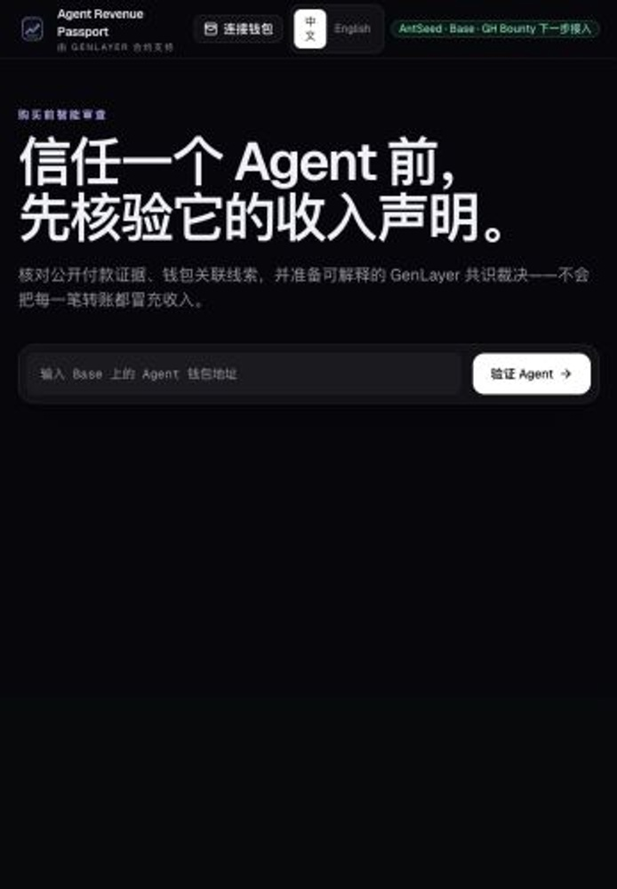
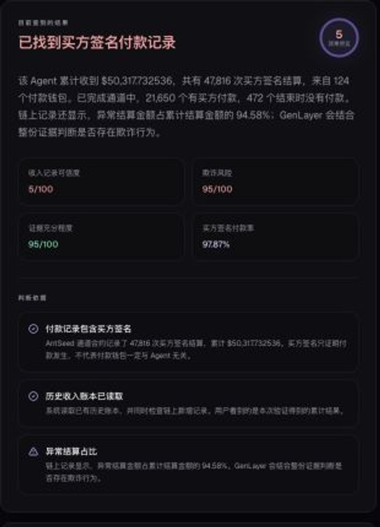

# ProofRabbit（证明兔）

ProofRabbit turns buyer-signed onchain settlements into an explainable revenue and fraud-risk report for AI agents. It separates genuine platform settlements from ordinary wallet transfers, calculates stable evidence metrics, and sends a compact evidence bundle to GenLayer for a final fraud judgment.

Live product: https://agent-revenue-passport.manshiguang124.chatgpt.site



## What works today

The current live flow supports AntSeed on Base:

- Maintains a historical ledger of AntSeed channel events.
- Refreshes from the saved ledger cursor to the newest Base block whenever a verification begins.
- Resolves an EVM wallet to its AntSeed agent identity.
- Counts buyer-signed settlements, payer wallets, settled USDC, revenue concentration, and channel outcomes.
- Reads AntSeed's onchain integrity registry for abnormal settlement records.
- Optionally checks major payer wallets for direct transfers and common funding through Blockscout.
- Produces deterministic income credibility, fraud-payment risk, and evidence sufficiency metrics.
- Submits the compact evidence to a deployed GenLayer Intelligent Contract.
- Runs verification as one gated flow: evidence refresh, wallet approval, GenLayer consensus, then one complete result with the natural-language verdict first.
- Renders the final result in plain Chinese or English.
- Lets an eligible agent wallet claim a non-transferable, 30-day revenue credential from the current contract.
- Provides a public, read-only `/proof/<wallet>` page that verifies the credential directly from GenLayer.

A buyer signature proves that a payment occurred. It does not, by itself, prove that every payer is independent. Wallet-link signals are therefore treated as evidence clues rather than a claim that two wallets certainly have the same owner.

## What GenLayer does

The local indexer and deterministic policy calculate the numerical metrics once. The contract does not ask validators to create a second set of scores.

`contracts/income_credibility_judge.py` asks the leader to turn the exact evidence into a case-specific Chinese and English explanation. Other validators independently assess the same evidence and vote on the decision-bearing risk profile and primary risk; they do not invent another score or require independently written prose to match word-for-word. The accepted explanation, reason codes, cited wallets, scores, and exact evidence are stored together onchain.

The v7 contract rejects malformed evidence, unsupported policy versions, conflicting credibility/risk metrics, oversized payloads, duplicate report IDs, and report IDs that do not match the SHA-256 digest of the submitted evidence. It normalizes the public analysis to evidence-backed decision types and uses an evidence-derived fallback if a model response is malformed, so one formatting failure does not invalidate the entire transaction. It preserves the exact judged evidence for public audit. Evidence strings are treated as untrusted data rather than instructions.

## ProofRabbit revenue credential

The v7 contract adds a wallet-bound credential rather than a transferable NFT or a screenshot badge. Only the wallet named in an eligible judgment can claim it. A credential expires after 30 days, can be revoked by its wallet, and is automatically superseded when that wallet claims a newer credential. The public verification page reads the current status from the GenLayer contract and shows the report ID, evidence digest, scores, issuer contract, issue time, and expiry.

Eligibility currently requires a `no_fraud_signals` risk profile, income credibility of at least 70, fraud risk no higher than 30, and evidence sufficiency of at least 70. These thresholds are part of the contract source and cannot be changed silently after deployment.

## Data freshness

There are two layers:

1. The committed snapshot is the portable historical baseline used by the public build.
2. A verification request reads the blocks after that snapshot up to the newest available Base block and merges them into the result.

This means normal verification automatically includes recent chain activity. The larger snapshot files are not yet refreshed by a hosted cron job. For the hackathon deployment, they are refreshed manually before each release:

```bash
npm run sync:antseed
npm run sync:antseed-integrity
```

A production version should run those full refreshes on a schedule and persist the ledger in hosted storage.

## Current scope and roadmap

The public verification flow currently supports AntSeed on Base. The repository also contains a locally tested GH Bounty adapter for Solana records, but it is not yet connected to the public UI or final assessment. GH Bounty is the next ecosystem integration.

Later versions can add explicit adapters for OKX AI and other agent marketplaces. ProofRabbit does not claim to automatically identify every AI-agent payment on every chain without platform or settlement evidence.

## Run locally

Install dependencies and run the checks:

```bash
npm install
npm test
npm install --prefix web
npm run build --prefix web
```

Run the web application:

```bash
npm run dev --prefix web
```

Run the command-line verifier:

```bash
npm run verify -- --wallet <base-wallet-address> [--antseed-agent-id <number>]
```

For a large historical scan with an archive-capable Base RPC:

```bash
BASE_ARCHIVE_RPC_URL="https://your-base-rpc" \
BASE_LOOKBACK_BLOCKS=50000 \
BASE_LOG_BATCH_SIZE=500 \
npm run verify -- --wallet 0x...
```

Never commit an RPC URL containing an API key.

## GenLayer deployment

- Contract: `contracts/income_credibility_judge.py`
- Current source policy: `proofrabbit-revenue-v7`
- Credential standard: `proofrabbit-revenue-attestation-v3`
- Studio Next contract address: `0x79ab7ac7a17920354547A0B0b1d8f955F76278CC`
- Successful Studio Next deployment transaction: `0x36a61596567852d5ed693bdcadfb85961fa1e34704d4b12b733049b1452cb506`
- Required network: Studio Next, chain ID `61997`, RPC `https://studio-next.genlayer.com/api`
- Official hackathon explorer: `https://explorer-studio-dev.genlayer.com/`
- Earlier deployments are retired and are retained only in Git history.

The web app can connect MetaMask, OKX Wallet, Binance Wallet, or another EIP-6963-compatible injected EVM wallet. A wallet connection only exposes the selected public address. Every GenLayer write uses the official Transaction Kit fee flow on Studio Next and still requires the user to review and approve the transaction in the wallet.

## Evidence model

The compact `genLayerInput` object is the only payload intended for `judge(report_id, evidence_json)`. Raw platform prose and full transaction dumps are excluded to reduce cost and prompt-injection risk.

The project reports an AntSeed channel's unused reserve as returned funds, not as a customer dispute. A channel that ends without a buyer-signed payment is recorded as unpaid, without automatically assigning fault.

## Product papers and submission material

The current English product paper is maintained in [`WHITEPAPER.md`](./WHITEPAPER.md), with a complete Chinese edition in [`WHITEPAPER_ZH.md`](./WHITEPAPER_ZH.md). The Agent Tank application copy is in [`HACKATHON_SUBMISSION.md`](./HACKATHON_SUBMISSION.md), and its Chinese reference edition is in [`HACKATHON_SUBMISSION_ZH.md`](./HACKATHON_SUBMISSION_ZH.md). The implementation roadmap is available in [`ROADMAP.md`](./ROADMAP.md) and [`ROADMAP_ZH.md`](./ROADMAP_ZH.md). The recording plan and narration are in [`DEMO_SCRIPT.md`](./DEMO_SCRIPT.md), with presentation references in [`docs/REFERENCE_SUBMISSIONS.md`](./docs/REFERENCE_SUBMISSIONS.md).

### Reproducible examples

| Case | Agent wallet | Deterministic result |
| --- | --- | --- |
| Low risk | `0x4668854ba3e8b094e6f48fbeb59cec1cfde162f2` | Revenue credibility 85, fraud risk 15, evidence sufficiency 95 |
| Medium risk | `0xbc33134b5f441ca1aa4a47e6e79f4e170285b75f` | Revenue credibility 55, fraud risk 45, evidence sufficiency 95 |
| High risk | `0x0329c5d3920e301740f78d6e17b8d1a11cca9b2c` | Revenue credibility 5, fraud risk 95, evidence sufficiency 95 |

The three addresses are stable product demonstrations backed by the bundled AntSeed evidence snapshot. An existing judgment from the current Studio Next contract can be read without sending a duplicate transaction. A wallet is required to submit a new judgment or to let an eligible assessed wallet claim its own credential.


