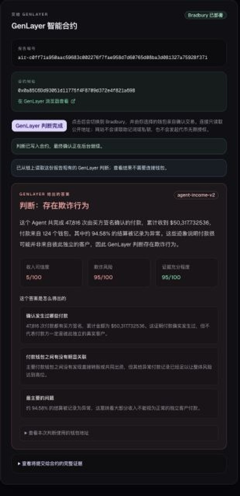

# Agent Revenue Passport

Agent Revenue Passport turns buyer-signed onchain settlements into a portable revenue-integrity profile for AI agents. It separates genuine platform settlements from ordinary wallet transfers, calculates stable evidence metrics, and sends a compact evidence bundle to GenLayer for a final fraud judgment.

Live product: https://agent-revenue-passport.manshiguang124.chatgpt.site


## What works today

The current live flow supports AntSeed on Base:

- Maintains a historical ledger of AntSeed channel events.
- Refreshes from the saved ledger cursor to the newest Base block whenever a verification begins.
- Resolves an EVM wallet to its AntSeed agent identity.
- Counts buyer-signed settlements, payer wallets, settled USDC, revenue concentration, and channel outcomes.
- Reads AntSeed's onchain integrity registry for abnormal settlement records.
- Optionally checks major payer wallets for direct transfers and common funding through Blockscout.
- Produces deterministic income credibility, fraud-payment risk, and evidence sufficiency metrics.
- Submits the compact evidence to a deployed GenLayer Intelligent Contract.
- Renders the final result in plain Chinese or English.

A buyer signature proves that a payment occurred. It does not, by itself, prove that every payer is independent. Wallet-link signals are therefore treated as evidence clues rather than a claim that two wallets certainly have the same owner.

## What GenLayer does

The local indexer and deterministic policy calculate the numerical metrics once. The deployed v2 contract does not ask validators to create a second set of scores.

`contracts/income_credibility_judge.py` asks GenLayer validators one bounded question: do the submitted facts support a finding of fraudulent revenue activity? The contract stores the agreed verdict together with reason codes and cited wallets. User-facing wording stays in the website, so the Chinese and English explanation can improve without redeploying the contract.

The contract rejects malformed evidence, unsupported policy versions, conflicting credibility/risk metrics, oversized payloads, and duplicate report IDs. Evidence strings are treated as untrusted data rather than instructions.

## Data freshness

There are two layers:

1. The committed snapshot is the portable historical baseline used by the public build.
2. A verification request reads the blocks after that snapshot up to the newest available Base block and merges them into the result.

This means normal verification automatically includes recent chain activity. The larger snapshot files are not yet refreshed by a hosted cron job. For the hackathon deployment, they are refreshed manually before each release:

```bash
npm run sync:antseed
npm run sync:antseed-integrity
```

A production version should run those full refreshes on a schedule and persist the ledger in hosted storage.

## Current scope and roadmap

The public verification flow currently supports AntSeed on Base. The repository also contains a locally tested GH Bounty adapter for Solana records, but it is not yet connected to the public UI or final assessment. GH Bounty is the next ecosystem integration.

Later versions can add explicit adapters for OKX AI and other agent marketplaces. Agent Revenue Passport does not claim to automatically identify every AI-agent payment on every chain without platform or settlement evidence.

## Run locally

Install dependencies and run the checks:

```bash
npm install
npm test
npm install --prefix web
npm run build --prefix web
```

Run the web application:

```bash
npm run dev --prefix web
```

Run the command-line verifier:

```bash
npm run verify -- --wallet <base-wallet-address> [--antseed-agent-id <number>]
```

For a large historical scan with an archive-capable Base RPC:

```bash
BASE_ARCHIVE_RPC_URL="https://your-base-rpc" \
BASE_LOOKBACK_BLOCKS=50000 \
BASE_LOG_BATCH_SIZE=500 \
npm run verify -- --wallet 0x...
```

Never commit an RPC URL containing an API key.

## GenLayer deployment

- Contract: `contracts/income_credibility_judge.py`
- Policy version: `agent-income-v2`
- Bradbury contract address: `0x0a85C6Dd93051d11775f4F8709d372e4f821a698`
- Explorer: `https://explorer-bradbury.genlayer.com/address/0x0a85C6Dd93051d11775f4F8709d372e4f821a698`
- Deployment transaction: `0x4c86150c0a772e818fee99e91044a282d84be6514df4240499f8342eb11f9e43`

The web app can connect MetaMask, OKX Wallet, Binance Wallet, or another EIP-6963-compatible injected EVM wallet. A wallet connection only exposes the selected public address. An actual GenLayer write still requires the user to review and approve a Bradbury testnet transaction in the wallet.

## Evidence model

The compact `genLayerInput` object is the only payload intended for `judge(report_id, evidence_json)`. Raw platform prose and full transaction dumps are excluded to reduce cost and prompt-injection risk.

The project reports an AntSeed channel's unused reserve as returned funds, not as a customer dispute. A channel that ends without a buyer-signed payment is recorded as unpaid, without automatically assigning fault.

## Submission material

The complete Agent Tank application copy is maintained in [`HACKATHON_SUBMISSION.md`](./HACKATHON_SUBMISSION.md). The recording plan and narration are in [`DEMO_SCRIPT.md`](./DEMO_SCRIPT.md), with presentation references in [`docs/REFERENCE_SUBMISSIONS.md`](./docs/REFERENCE_SUBMISSIONS.md).

### Reproducible examples

| Case | Agent wallet | Deterministic result |
| --- | --- | --- |
| Low risk | `0x4668854ba3e8b094e6f48fbeb59cec1cfde162f2` | Revenue credibility 85, fraud risk 15, evidence sufficiency 95 |
| Medium risk | `0xbc33134b5f441ca1aa4a47e6e79f4e170285b75f` | Revenue credibility 55, fraud risk 45, evidence sufficiency 95 |
| High risk | `0x0329c5d3920e301740f78d6e17b8d1a11cca9b2c` | Revenue credibility 5, fraud risk 95, evidence sufficiency 95 |

The high-risk report already has a stored GenLayer v2 judgment. The public site reads that existing result without requiring a wallet connection. A wallet is required only when the visitor chooses to submit a new report on Bradbury.



